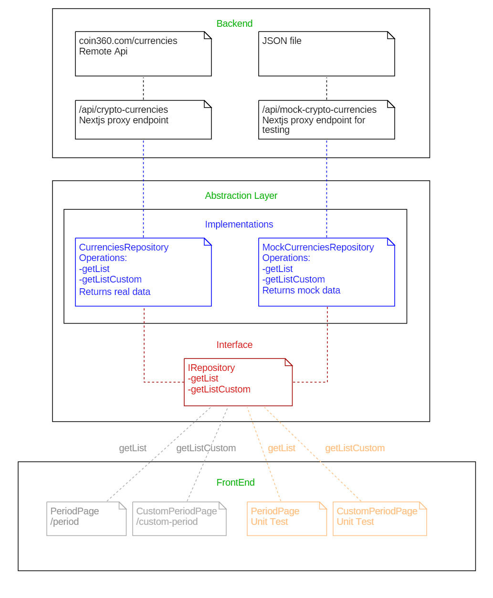

# CryptoValues

This project was generated using [Nx](https://nx.dev).

## Demo

https://crypto-values-yagolopez.vercel.app/

## Development server

Run `nx serve crypto-values` for a dev server. Navigate to http://localhost:4200/. The app will automatically reload if you change any of the source files.

## Build

Run `nx build crypto-values` to build the project. The build artifacts will be stored in the `dist/` directory. Use the `--prod` flag for a production build.

## Running unit tests

Run `nx test crypto-values` to execute the unit tests via [Jest](https://jestjs.io).

## Running end-to-end tests

Run `nx run crypto-values-e2e:e2e` to execute the end-to-end tests via [Cypress](https://www.cypress.io).

Run `npm run cypress` to open Cypress UI and run tests (Server running in http://localhost:4200 is needed).

## Running the linter

Run `nx run crypto-values:lint` to execute the linter.

## Understand the monorepo workspace

This monorepo contains two projects:

- An **app** called `crypto-values` 
- A **library** used by the app called `react-query-crud`

Run `nx dep-graph` to see a diagram of the dependencies of the project.

Run `npm run` to see a list of available scripts.

## Tech Stack

- NextJS
- TypeScript
- Formatting and Static Code Analysis:
  - ESLint
  - Prettier

- [React Virtualized](https://github.com/bvaughn/react-virtualized) Component for rendering huge lists
- [Material UI](https://react-query.tanstack.com/) component library
- Testing
  - Jest and React Testing Library
  - E2E: Cypress

## Architecture

- Use of a Data Abstraction Layer (DAL)
- Decoupling of frontend from backend: the purpose is to use a common interface with different implementatios for real data, mock data or even graphql. So changing the way of getting data should not affect front end code
- The app uses some OOP principles and patterns
  - Domain concepts are modeled as entities like `ICurrency`, for example
  - Use of Repository Pattern
  - Use of Singleton Pattern to avoid creating new instances of repositories each re-render

- Abstraction layer functionality is grouped in a ad hoc library I created called `react-query-crud` based in [react-query](https://react-query.tanstack.com/). This case only reads data but usually DAL executes CRUD operations
- [ReactQuery](https://react-query.tanstack.com/) provides good support for real-time data, fetching data from endpoints in time intervals. Also data is always up to date since each time the browser receives the focus new data is refetched. This is a ReactQuery feature.
- There are two api endpoints defined as Nextjs Servless Functions
  - [/api/crypto-currencies](/api/crypto-currencies) acts as proxy to the coin360.com remote api
  - [/api/mock-crypto-currencies](/api/mock-crypto-currencies) returns mock data from a JSON file

